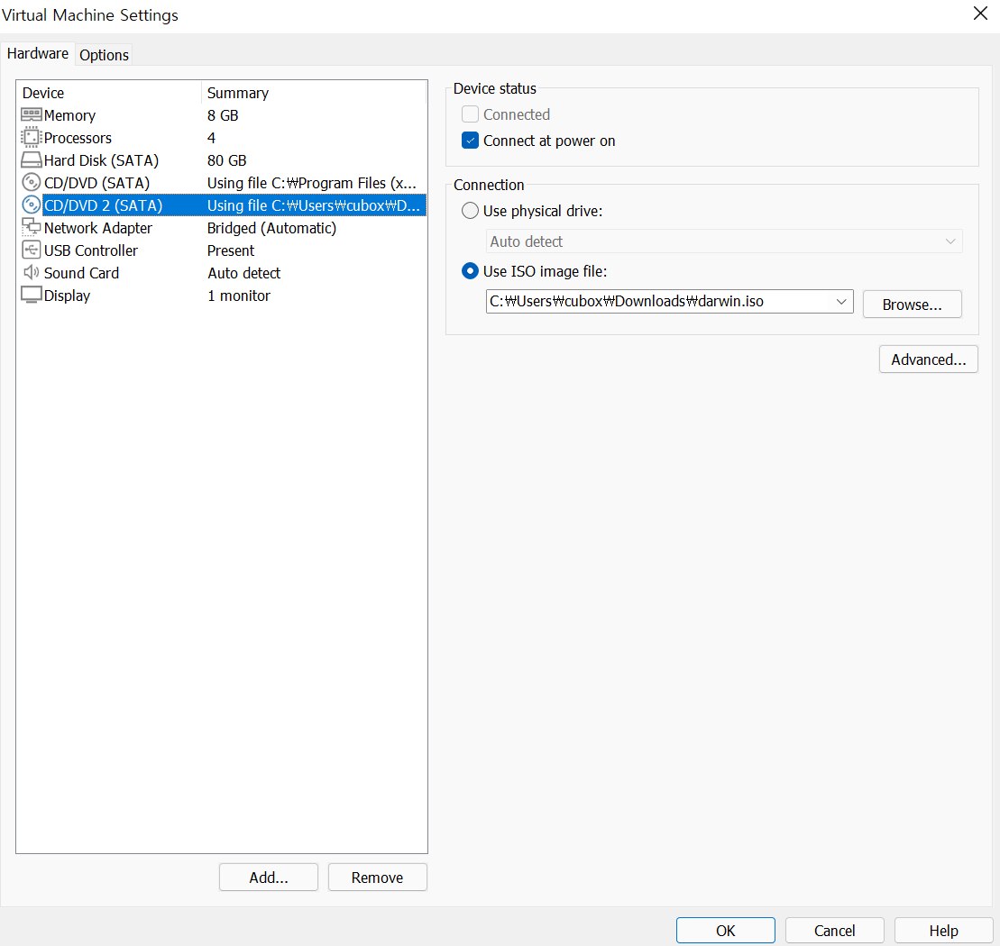

오류 메세지: CD/DVD 인식 실패
```
This operation cannot proceed because your Mac OS guest is using the CD/DVD.
Dismiss this message, eject the disc from inside the guest, and retry this operation.
```

darwin.iso( Mac OS VMware Tool ) 를 직접 주입해야함

설치한 Mac OS 버전에 맞게 [darwin.iso](http://softwareupdate.vmware.com/cds/vmw-desktop/fusion/) 다운로드

<br>

Guest OS 종료 후,
새로운 CD/DVD 추가해서 다운 받은 파일 지정



<br>

재시동 했을 때 바탕화면에 우측 상단에 떠있는 VMware Tools 클릭해서 설치하면 됨
